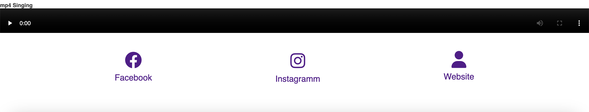
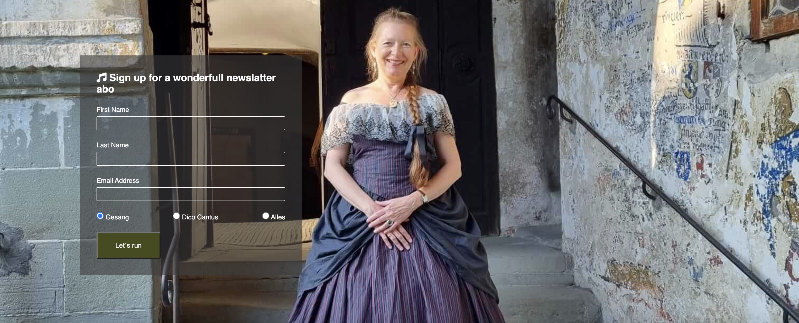

# Project 1 Cristina

The webpage is aimed at lovers of classical music and give them the possibility
to see the annual events from Cristina Haigis and Peter Hastedt as
well as her company Dico Cantus.

They will be able to see where and when the concerts take place during the
whole year.

As most of the audience come through word of mouth it is also a great possibility
to present the concerts to a new audience

The site user are lovers of classical music but mostly the audience of the
concerts and there friends .It is focussed
on giving them a nice image of what will await them during the concerts.

The idea of this webpage is to enlarge the number of people who visit
the concerts during the year .

### Structure

It follows an easy structure where right on the first webside one can see all
the information one needs .

#### Website Sections:

1. **_Home_** The most complex page where all the information is presented
   with a nice background image and a mp4 reproduction
2. **_Gallery_** Here all the images from various concerts are presented
3. **_Signup_** This gives the users the possibility to suscribe to a newsletter

## Skeleton

The website is really clear and simple it uses on all three pages the same
header and footer so the interaction with the user is always the same and has
no background color that would disturb the UI

## Surface

The **_Homepage_** and the **_Signup_** page share the same background image
the **_Gallerypage_** has a mixture of images everything is quite
harmonious

Background image main section

### Features:

#### Navigation Bar

- The navigation bar is at the top of the website and it doesn't scroll (fixed)
- At the right part are the links to the different webpages
- The active website is always underline by the class active
- On the left side is the name Cristina Haigis which is a link to the Homepage

### Main Section

    below the background image shown above

- The headers shows the calender year
- The 6 div elements gives the users all the information about the concerts
- It is divided in 6 differen parts three on each side
- Each one represent one concert with its data
- In the middle vertical part is an image
- I tried to put them as symmetrical as possible on each
  side

### Lower Main Footer Section

- At the end of the main section is the mp4 video it can be expanded
- It helps the user get an idea of the qualities of the concerts
- The footer has three links to the Facebook Instagram and a Personal
- Website where one can see more information related to the website
- All this is a strong incentive to the user to visit the concerts

### SignUp

- It has the same background images as in the index.html
- On the left part of the image is the form through which
- on can collect name email and there preference
- It helps stay in contact with the user and motivate him
  to visit the concerts

### Testing
